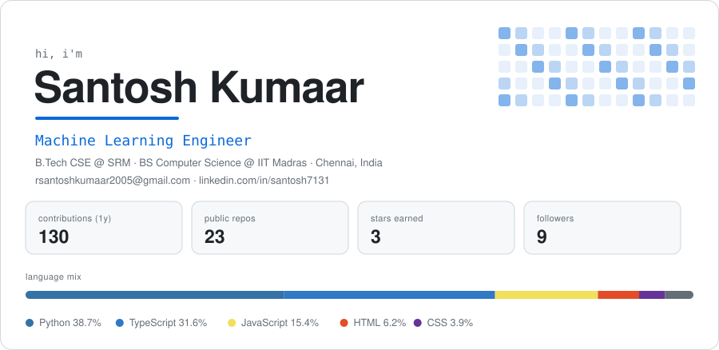
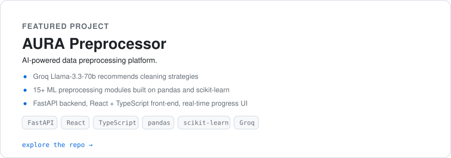
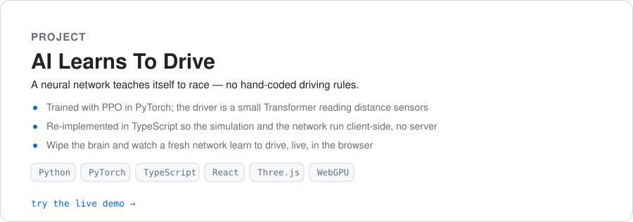
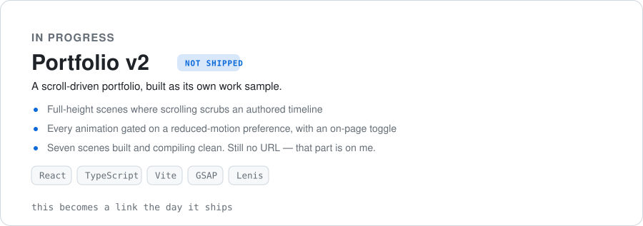

  <picture>
    <source media="(prefers-color-scheme: dark)" srcset="assets/identity-dark.svg">
    
  </picture>

  <a href="https://github.com/Santosh7131/Aura-Preprocessor">
    <picture>
      <source media="(prefers-color-scheme: dark)" srcset="assets/project-aura-dark.svg">
      
    </picture>
  </a>

  <a href="https://ai-learns-to-drive.onrender.com">
    <picture>
      <source media="(prefers-color-scheme: dark)" srcset="assets/project-drive-dark.svg">
      
    </picture>
  </a>

  <a href="https://portfolio-v2-two-snowy-32.vercel.app">
    <picture>
      <source media="(prefers-color-scheme: dark)" srcset="assets/project-portfolio-dark.svg">
      
    </picture>
  </a>

  <picture>
    <source media="(prefers-color-scheme: dark)" srcset="assets/stack-dark.svg">
    
  </picture>

## 🏙️ Contribution skyline

  <picture>
    <source media="(prefers-color-scheme: dark)" srcset="profile-3d-contrib/profile-3d-dark.svg">
    
  </picture>

