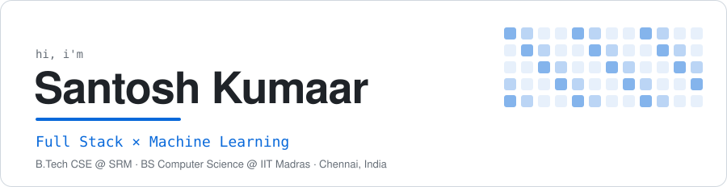
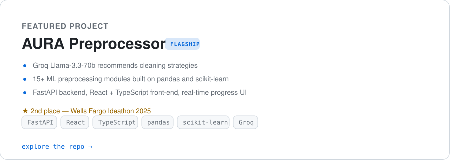
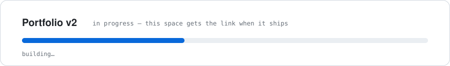
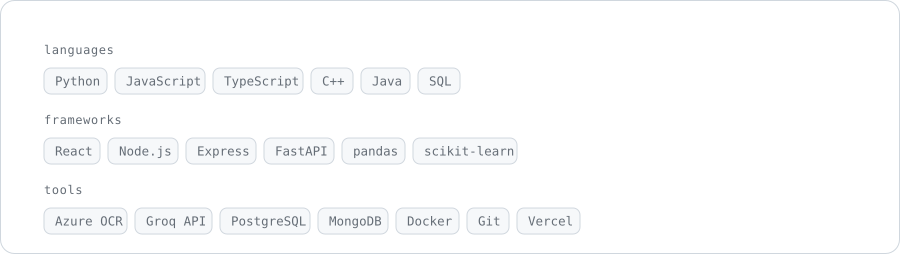
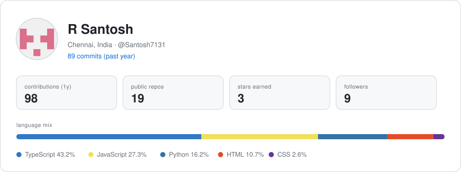
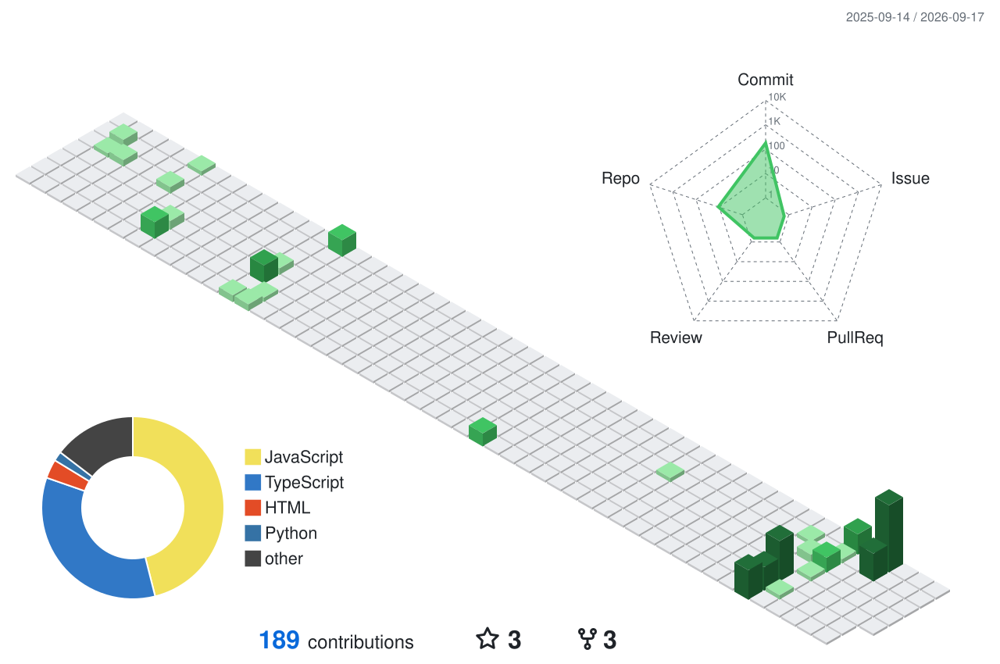

  <picture>
    <source media="(prefers-color-scheme: dark)" srcset="assets/hero-dark.svg">
    
  </picture>

  
  
  

  <a href="https://github.com/Santosh7131/Aura-Preprocessor">
    <picture>
      <source media="(prefers-color-scheme: dark)" srcset="assets/aura-dark.svg">
      
    </picture>
  </a>

  <picture>
    <source media="(prefers-color-scheme: dark)" srcset="assets/portfolio-dark.svg">
    
  </picture>

  <picture>
    <source media="(prefers-color-scheme: dark)" srcset="assets/stack-dark.svg">
    
  </picture>

## 📊 GitHub at a glance

  <picture>
    <source media="(prefers-color-scheme: dark)" srcset="profile-card/profile-card-dark.svg">
    
  </picture>

## 🏙️ Contribution skyline

  <picture>
    <source media="(prefers-color-scheme: dark)" srcset="profile-3d-contrib/profile-3d-dark.svg">
    
  </picture>

  regenerated daily — the 3D graph via <a href="https://github.com/yoshi389111/github-profile-3d-contrib">github-profile-3d-contrib</a>, the card by a script in this repo

